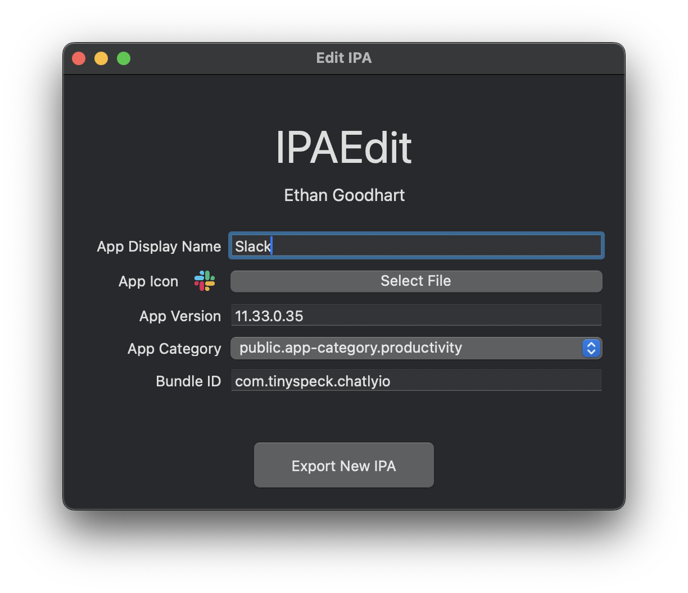

# IPAEdit
Mac app to modify .ipa metadata including app icon, display name, and app version to avoid updates 
  

Compatible with macOS 10.11+

## Install
To install either click [here](https://github.com/ethandgoodhart/IPAEdit/releases/latest/download/IPAEdit.zip) to download the latest version of the app or clone the project and run it in XCode
  
